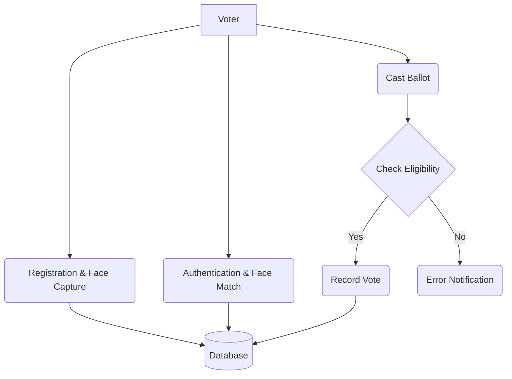
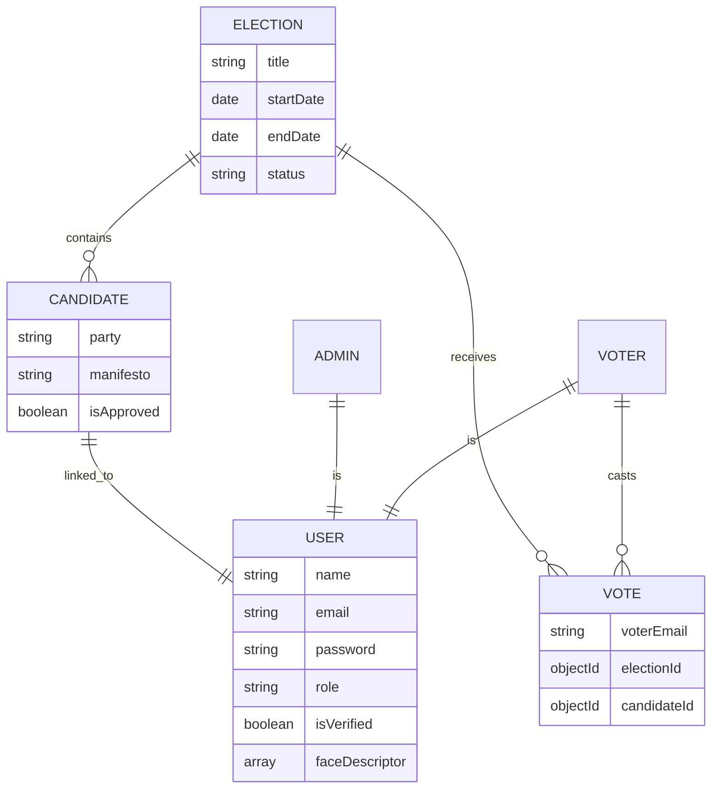

# FINAL YEAR PROJECT REPORT: ONLINE VOTING SYSTEM

## ABSTRACT
The **Online Voting System** is a platform designed to revolutionize the democratic process by leveraging modern web technologies to provide a secure, transparent, and accessible voting environment. In the current digital age, traditional paper-based voting systems are increasingly burdened by logistical inefficiencies, high costs, and susceptibility to human error or fraud. This project implements a MERN (MongoDB, Express, React, Node.js) stack solution that incorporates biometric face recognition (Face-API) to ensure authentic voter participation. By decentralizing the polling station to the voter's screen, this system aims to increase voter turnout while maintaining the highest standards of cryptographic security and data integrity.

## PREFACE
This documentation provides a comprehensive overview of the design, development, and implementation of the Online Voting System. It is structured to guide the reader through the initial problem definition, systems analysis, architectural design, and final implementation details. Each chapter delves into the technical and operational aspects of the project, serving as a formal record of the methodologies employed to solve the challenges of remote digital voting.

## Table of Contents
1. [Chapter 1: Introduction](#chapter-1-introduction)
    - 1.1 Project Overview
    - 1.2 Motivation
    - 1.3 Objectives
    - 1.4 Company/Institution Profile
2. [Chapter 2: System Study](#chapter-2-system-study)
    - 2.1 Analysis of Existing Systems
    - 2.2 Threats and Vulnerabilities in Manual Voting
    - 2.3 Proposed Solution
    - 2.4 Problem Definition
    - 2.5 Scope of the Project
3. [Chapter 3: Systems Analysis](#chapter-3-systems-analysis)
...


---

## Chapter 1: Introduction

### 1.1 Project Overview
The **Online Voting System** is a sophisticated digital platform tailored for educational institutions, corporate organizations, or small-scale governmental elections. Built using the robust MERN stack, the application prioritizes security and user experience. Unlike traditional systems that require physical proximity to a ballot box, this platform allows authorized voters to cast their ballots from any device with a webcam and internet connection. The integration of `face-api.js` adds a critical layer of biometric security, preventing impersonation and ensuring that only the registered user can access their specific voting session.

### 1.2 Motivation
The motivation behind this project stems from the declining voter turnout observed in many modern elections due to logistical hurdles. Furthermore, the immense cost of printing ballot papers, setting up physical booths, and hiring security personnel can be significantly reduced through digitization. By creating a system that is both secure and convenient, we aim to modernize the democratic process and make it future-ready.

### 1.3 Objectives
- **To provide a secure authentication mechanism** using JWT and Biometric recognition.
- **To ensure data integrity** by preventing duplicate votes and unauthorized data manipulation.
- **To offer real-time visualization** of election results through interactive charts.
- **To streamline candidate management**, allowing for efficient application and approval workflows.
- **To maintain a transparent and auditable trail** of all election activities.

### 1.4 Company/Institution Profile
**Digital Solutions Enterprise (DSE)**
DSE is a leading-edge technology firm specializing in secure identity management and scalable web architectures. With a focus on civic tech, the company aims to bridge the gap between traditional bureaucracy and modern digital efficiency.
- **Established:** 2015
- **Expertise:** MERN Stack, AI-driven Authentication, Cloud Infrastructure.
- **Goal:** Empowering organizations with transparent digital governance tools.

---

## Chapter 2: System Study

### 2.1 Analysis of Existing Systems
Traditional voting systems primarily rely on physical infrastructure:
- **Paper Ballots:** Voters mark a physical sheet and drop it in a locked box.
- **Electronic Voting Machines (EVMs):** Physical devices located at designated polling stations.
- **Manual Verification:** Identity is checked by officials comparing physical ID cards with a printed registry.

### 2.2 Threats and Vulnerabilities in Manual Voting
1. **Physical Sabotage:** Ballot boxes can be stolen or tampered with.
2. **Logistical Nightmare:** Distributing materials to remote areas is costly and slow.
3. **Voter Suppression:** Long lines and limited booth locations discourage participation.
4. **Human Error:** Manual counting is prone to mistakes, leading to controversies.
5. **Cost Inefficiency:** Millions are spent on logistics that become redundant once the election is over.

### 2.3 Proposed Solution
The proposed Online Voting System addresses these vulnerabilities by:
- **Decentralizing Voting:** Removing the need for physical booths through a secure web portal.
- **Cryptographic Security:** Encrypting user data and using secure tokens for session management.
- **Biometric Auditing:** Using face recognition to verify the person behind the screen.
- **Instant Tabulation:** Results are updated in real-time as soon as a vote is cast, eliminating counting delays.

### 2.4 Problem Definition
In the current landscape, there is a lack of accessible, secure, and low-cost voting solutions for mid-sized organizations. Most existing digital voting tools either lack the security features required for high-stakes decisions or are too complex and expensive for general use. This project defines a middle-ground solution that is both highly secure (Biometric + JWT) and easy to deploy.

### 2.5 Scope of the Project
The scope of this project encompasses the development of:
- A secure voter registration and login module.
- A candidate application and management system.
- An admin dashboard for election creation and monitoring.
- A real-time result visualization engine.
- Biometric verification scripts for authenticating voters during registration and voting.

---


---

## Chapter 3: Systems Analysis

### 3.1 Technical Stack Selection
The selection of the MERN stack for this project was based on its efficiency in handling high-concurrency environments and its robust developer ecosystem.

#### 3.1.1 Front-end Technologies
- **React.js (via Vite):** Chosen for its component-based architecture and fast rendering capabilities. Vite provides a modern build tool that ensures rapid development cycles.
- **Tailwind CSS:** Utilized for creating a utility-first, responsive design that ensures accessibility across all device types.
- **Face-api.js:** Built on top of Tensorflow.js, this library allows for neural network-based face detection and recognition directly in the browser, ensuring biometric data never leaves the client's device during extraction.
- **Recharts & Framer Motion:** Enhances the user experience with interactive data visualization and smooth interface transitions.

#### 3.1.2 Back-end Technologies
- **Node.js & Express:** Provides a non-blocking, event-driven architecture suitable for a voting system that may receive thousands of simultaneous requests.
- **MongoDB (NoSQL):** Offers the flexibility needed for storing varied candidate profiles and election metadata while maintaining high performance for read/write operations.
- **JSON Web Token (JWT):** Implements a stateless authentication protocol, essential for secure session management without overloading the server's memory.

### 3.2 Resources Required
#### 3.2.1 Hardware Requirements
| Resource | Minimum Specification | Recommended Specification |
| :--- | :--- | :--- |
| Processor | Dual Core 2.0GHz | Quad Core 3.0GHz+ |
| RAM | 4 GB | 8 GB or higher |
| Camera | 720p Integrated Webcam | 1080p HD External/Internal |
| Storage | 1 GB Free Space | 5 GB SSD Space |

#### 3.2.2 Software Requirements
- **Operating System:** Windows 10/11, Ubuntu 20.04+, or macOS.
- **Runtime:** Node.js v18.x or v20.x (LTS).
- **Database:** MongoDB Community Edition v6.0+.
- **Version Control:** Git v2.30+.

### 3.3 Feasibility Study
#### 3.3.1 Technical Feasibility
The project utilizes proven technologies. The integration of face recognition via `face-api.js` is technically feasible as modern browsers support the required WebGL and WASM features.
#### 3.3.2 Economic Feasibility
By moving to an online platform, the organization saves on paper, printing, transportation, and staffing. The operational cost of a cloud-hosted MERN application is significantly lower than traditional voting logistics.
#### 3.3.3 Operational Feasibility
The system is designed with a user-centric approach. With a simple "One-Click Voting" interface and automated face verification, even non-technical users can participate with minimal training.

### 3.4 Data Flow Diagrams (DFD)

#### 3.4.1 Level 0 DFD (Context Diagram)


#### 3.4.2 Level 1 DFD (Process Decomposition)


---

## Chapter 4: System Design

### 4.1 System Architecture
The system employs a **Three-Tier Architecture**:
1. **Presentation Tier (React):** Manages user interactions, dashboard rendering, and biometric extraction.
2. **Application Tier (Express/Node):** Processes business logic, validates tokens, and interacts with the database.
3. **Data Tier (MongoDB):** Ensures persistent storage and data integrity.

### 4.2 I/O Form Design
Detailed descriptions of primary forms:
- **Registration Form:** Includes fields for Name, Phone, and a webcam interface for capturing the 128-float face descriptor.
- **Candidate Application:** A comprehensive multi-part form capturing personal background, educational history, and legal declarations.
- **Voting Portal:** A secure interface displaying active elections with candidate profiles and "Vote" buttons.

### 4.3 Database Schema (ER Diagram)
Below is the formalized Entity-Relationship Diagram representing the MERN schemas.



### 4.4 Normalization
While MongoDB is a document-oriented database, the system follows a semi-normalized approach:
- **Users and Candidates** are linked via `userId` to avoid data redundancy.
- **Votes** reference `electionId` and `candidateId` using ObjectIDs.
- **Unique Constraints:** A compound unique index `(voterEmail, electionId)` is implemented at the database level to programmatically prevent double voting.

---

---

## Chapter 5: Coding and Debugging

### 5.1 Modules and Functional Documentation
The application is modularized to ensure maintainability and separation of concerns.

- **`authController.js`:** Manages the entire lifecycle of a user session. It includes logic for password hashing using `bcrypt`, JWT payload generation, and biometric descriptor storage.
- **`voterMiddleware.js`:** A custom Express middleware that intercepts voting requests to verify the JWT and check the voter's status in the database.
- **`candidateRoutes.js`:** Handles the multi-part form submissions for candidate applications, including document storage via `Multer`.
- **`resultsService.js`:** A background service that aggregates votes using MongoDB's `$group` and `$sum` aggregation pipelines to provide real-time statistics.

### 5.2 Algorithm for Biometric Face Verification
The core of the system's security is the face verification algorithm.

**Algorithm: Biometric Match**
1. **Input:** Live video stream frame and `storedDescriptor` from MongoDB.
2. **Extraction:** Use `face-api.js` (ResNet-101) to find the 128-point face landmarks of the current user.
3. **Calculation:** Compute the **Euclidean Distance** between the `currentDescriptor` and `storedDescriptor`.
4. **Decision:**
   - `IF (Distance < 0.6) THEN` Status = **MATCH**
   - `ELSE` Status = **MISMATCH**
5. **Output:** Grant or deny access based on the status.

### 5.3 Pseudo-code for Duplicate Vote Prevention
```javascript
async function castVote(voterId, electionId, candidateId) {
    // 1. Validate Election Status
    const election = await Election.findById(electionId);
    if (election.status !== 'ongoing') throw Error("ELECTION_NOT_ACTIVE");

    // 2. Check for Existing Vote (Atomic Check)
    try {
        const newVote = new Vote({ 
            voterEmail: voterId, 
            electionId, 
            candidateId 
        });
        await newVote.save(); // Unique index (voterEmail, electionId) prevents duplicates
        return { success: true };
    } catch (error) {
        if (error.code === 11000) throw Error("ALREADY_VOTED");
        throw error;
    }
}
```

---

## Chapter 6: Testing

### 6.1 Testing Methodology
The system underwent rigorous testing using a combination of manual and automated approaches to ensure reliability and security.

### 6.2 Unit Testing
Focused on individual functions like OTP generation, password hashing, and URI formatting. Every Mongoose schema was tested against boundary conditions (e.g., age < 18 for candidates).

### 6.3 Integration and System Testing
Verified the end-to-end data flow from the React frontend to the MongoDB backend. This included testing the biometric capture flow across different lighting conditions and camera qualities.

### 6.4 Formal Test Cases
| Test ID | Scenario | Input | Expected Output | Status |
| :--- | :--- | :--- | :--- | :--- |
| TC-01 | Voter Registration | Valid details + Face capture | Successful registration | Passed |
| TC-02 | Login Verification | Matching Email/Password | JWT Token issued + Dashboard access | Passed |
| TC-03 | Biometric Failure | Unauthorized person at webcam | Access Denied / Error Message | Passed |
| TC-04 | Double Voting | Casting 2nd vote in same election | 400 Bad Request: "Already Voted" | Passed |
| TC-05 | Result Visibility | Admin enables live results | Real-time charts populate on voter UI | Passed |

### 6.5 Error Handling and Debugging
Extensive `try-catch` blocks are implemented across the Express routes. Global error handlers capture unexpected exceptions and log them for administrative review while presenting a user-friendly message to the voter.

---


## Chapter 7: User Manual

### 7.1 System Setup and Configuration
This section provides a detailed guide for deploying the Online Voting System in a local or production environment.

#### 7.1.1 Environment Variables
Before starting the server, a `.env` file must be created in the `server` directory with the following keys:
- `PORT`: The port number for the Express server (e.g., 5000).
- `MONGO_URI`: The connection string for your MongoDB database.
- `JWT_SECRET`: A high-entropy string for signing authentication tokens.
- `EMAIL_USER` & `EMAIL_PASS`: Credentials for SMTP service (e.g., Gmail) to send OTPs.

#### 7.1.2 Installation Steps
1. **Clone the Repository:**
   ```bash
   git clone <repository_url>
   cd OnlineVoting
   ```
2. **Backend Setup:**
   ```bash
   cd server
   npm install
   npm run dev # Starts server with Nodemon
   ```
3. **Frontend Setup:**
   ```bash
   cd client
   npm install
   npm run dev # Starts Vite development server
   ```

### 7.2 User Operation Guide
#### 7.2.1 Voter Journey
- **Step 1: Registration:** Navigate to `/register`, provide identity details, and allow the browser to capture your face descriptor.
- **Step 2: Login:** Authenticate using your email/phone and password.
- **Step 3: Face Verification:** During sensitive actions like voting, the system will prompt for a real-time face check.
- **Step 4: Casting Vote:** Browse active elections, view candidate profiles, and click "Vote".

#### 7.2.2 Admin Journey
- **Step 1: Management:** Access the admin panel using privileged credentials.
- **Step 2: Election Creation:** Define election titles, start/end dates, and candidate limits.
- **Step 3: Verification:** Review and approve/reject candidate applications based on submitted documents.
- **Step 4: Monitoring:** Watch live voting statistics and publish results once the election ends.

---

## Chapter 8: Conclusion and Future Scope

### 8.1 Conclusion
The development of this **Online Voting System** demonstrates how modern web technologies can be harnessed to solve one of the most persistent challenges in civic administration. By integrating the MERN stack for speed and scalability with `face-api.js` for biometric security, the project provides a blueprint for a secure, paperless, and highly accessible democratic process. The system successfully prevents double-voting through database-level constraints and ensures voter authenticity through neural-network-backed face recognition.

### 8.2 Future Scope and Enhancements
While the current system is robust, several features could be added to further enhance its security and utility:
1. **Blockchain Integration:** Implementing a Decentralized Ledger (DLT) for vote storage would make the results immutable and provide public auditability.
2. **Advanced Multi-Factor Authentication (MFA):** Adding SMS-based or Authenticator App-based MFA in addition to Biometrics.
3. **AI-Based Fraud Detection:** Implementing threat detection algorithms to identify suspicious voting patterns or bot activities in real-time.
4. **Mobile Application:** Developing native iOS/Android applications to provide a more seamless biometric integration using FaceID or Fingerprint sensors.

### 8.3 Annexures
- **Annexure A:** Database Schema Definitions.
- **Annexure B:** API Documentation Snippets.
- **Annexure C:** Sample Candidate Application Form Layout.

---

## Bibliography
1. **Flanagan, D.** (2020). *JavaScript: The Definitive Guide*. O'Reilly Media.
2. **Banker, K.** (2016). *MongoDB in Action*. Manning Publications.
3. **Justadudewhohacks.** (2018). *Face-api.js: JavaScript API for Face Detection and Recognition*. GitHub Repository.
4. **Resig, J., & Bibeault, B.** (2016). *Secrets of the JavaScript Ninja*. Manning Publications.
5. **MERN Stack Community Docs.** (2024). *Best Practices for Scalable Web Applications*. [https://mern.io](https://mern.io)
6. **OWASP Foundation.** (2023). *Web Security Testing Guide*. [https://owasp.org](https://owasp.org)

